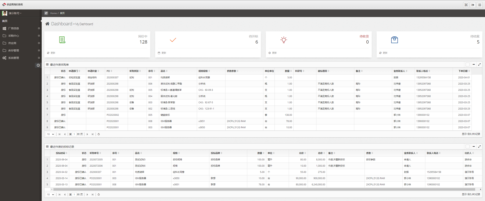
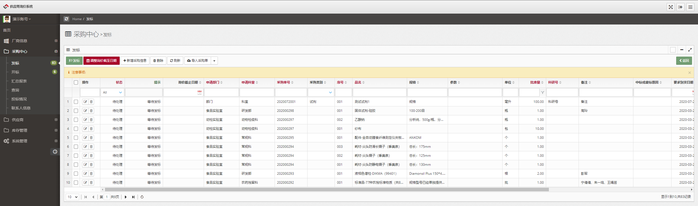

## Inquiry System Business Requirements

### Demo

[https://purchase.blazorserver.com](https://purchase.blazorserver.com/)

   + login as buyer 
   + demo / 123456
   + login as supplier 
   + supplier / 123456
### screen capture

1. Requirements

- Import: The operator imports the inquiry excel file (fields including: purchase order number, product name, specifications, unit, quantity, brand, item number, parameters, remarks, delivery date, business contact person, contact phone number, control price) and other information into the system.
- Issue: The operator selects the inquiry goods, enters the inquiry deadline, and the system sends the inquiry form to all suppliers, while reminding the supplier's contact person by SMS.

2. Bid

- Bidding: After receiving the inquiry notification, the supplier logs in to the system before the inquiry deadline and enters some information based on the inquiry form. The supplier can modify the product information (product name, specifications, unit, quantity, brand, item number, parameters, remarks, price, delivery date), etc.
- Re-bidding: Before the inquiry deadline, the supplier can re-quote. After the deadline, suppliers cannot make any modifications.
- Before the inquiry deadline, except for specially authorized users, other users cannot see bidding supplier information and quotation information. The system can prompt how many suppliers have bid.

3. Bid Opening

- After the inquiry deadline, the operator views the bidding situation of each product, and the system can prompt the content where the bidding information is inconsistent with the bid. The operator finally confirms the winning supplier, and the system notifies the winning supplier by SMS.
IV. Delivery and Receipt Management

- After receiving the winning bid notification, the supplier downloads and prints the winning bid notification QR code and pastes it in a conspicuous position outside the packaging box.
After receiving the goods, the receiving personnel scan the QR code, check the product information and invoice information, and confirm receipt if there are no errors.
4. Other Requirements

- Provide query function: Query multiple conditions (time, supplier, product, etc.) to inquire about inquiries, un-inquiries, inquiries in progress, delivered, and undelivered products.
- Specially authorized users can view all bidding information but cannot modify it.
- Develop a mobile version (mini-program or H5).
- The system is simple and easy to use, with a concise and elegant interface.
